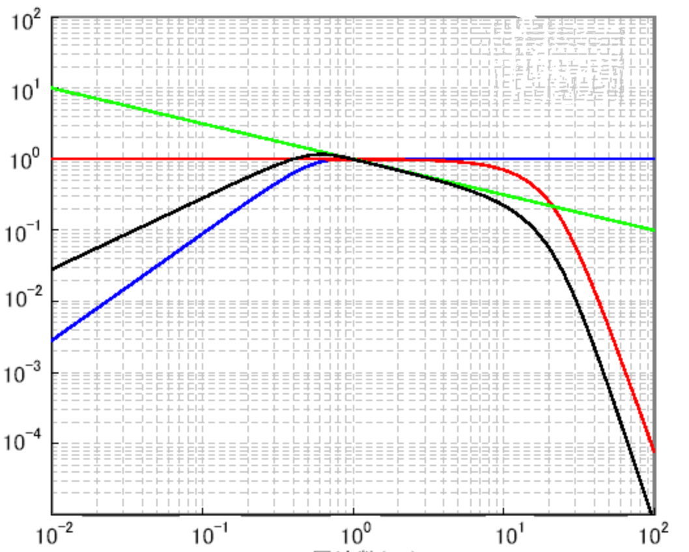
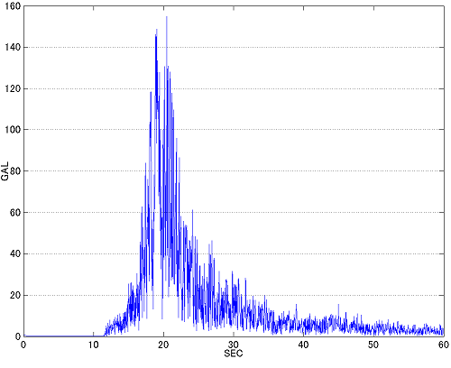

# Eric Hamber TurkeyBurkey CanSat

  
Seismometers are both useful and precise when it comes to measuring earthquakes or tremors. In humanity’s ongoing efforts in interplanetary exploration, scientists have developed an abundance of methods to assess the inhabitability of celestial bodies. However, to our understanding, there is yet to be any way to remotely test seismic activities—one must conduct these tests on the surface of these planetary bodies.

Our CanSat converts the seismograph measurements to the Richter scale and determine the magnitude of the tremors and accomplishes the following:

* Maintain structural and functional integrity while under the forces of launch/freefall.
* Collect air temperature and pressure data during freefall.
* Measure and record vibrations and tremors upon landing.
* Maintain a stable radio connection during freefall and landing over which experimental data may be transmitted.
* Receive accurate and precise data.

## Construction
The CanSat is built around the Arduino NANO V3. Etching and soldering our own circuit boards, these are the components used:
* MPU6050 gyro
* BN220 GPS sensor
* BMP180 barometric sensor
* RYLR896 LoRa radio transmitter/receiver

  
  
    
  (left) circuit diagram, (middle) PCB schematic, (right) etched and drilled circuit

    
  A diagram showing how the CanSat fits together

## The Seismometer
Due to the size constraints of the CanSat, the accuracy of the seismometer was achieved through software rather than hardware, relying on an MPU6050 Arduino module. This gyro converts physical movements from seismic activity into electrical signals through the analog inputs of the arduino. The entire process of parsing this data has already been studied extensively by the Japanese Meteorological Agency (JMA) and has been further developed to meet the needs of our CanSat. Our process is as follows:

1.  Get the X, Y, and Z angles and calculate the X-, Y-, and Z-components of measured acceleration
2.  Take multiple measurements in a short span of time (in our case 12 measurements every 0.12 seconds)
3.  Apply a Fourier transform to the 12-item datasets for the two horizontal (X and Y) and single vertical (Z) acceleration components, separating each acceleration into multiple trigonometric functions

  
    
  An example of a Fourier transform of seismometer data from the 2000 Earthquake in Tottori, Japan  
  (left) pre-Fourier transform, (right) post-Fourier transform

4.  Multiply these trigonometric functions by constants calculated by the JMA to “smooth” out the data, reducing instrumental noise

    
  (blue) high-cut filter removing high noise, (red) low-cut filter removing low noise, (black) data, (green) filtered data

5.  Perform the inverse Fourier transform that was applied in step 3 to merge the trigonometric functions back into the respective X-, Y-, and Z-components
6.  Synthesize these three components into a single vector

    
  The composite of the acceleration calculated by the seismometer after compiling all filtered data

7.  Calculate the seismic intensity of this calculated vector and its corresponding value on the Richter Scale. The formula we derived that creates the best data given our instrumentation follows the format `Intensity = 2 log a + 0.94` where a is the magnitude of the derived single vector.

## How to Run the TurkeyBurkey CanSat!!!
For some reason, if you wish to embark on a journey to build this TurkeyBurkey CanSat, you should probably download these libraries:
* [BMP180 library by Adafruit](https://github.com/adafruit/Adafruit-BMP085-Library)
* [BusIO library by Adafruit](https://github.com/adafruit/Adafruit_BusIO)
* [Filters library by JohnHub](https://github.com/JonHub/Filters)
* [Light MPU6050 library by rfetick](https://github.com/rfetick/MPU6050_light)
* [TinyGPS library by mikalhart](https://github.com/mikalhart/TinyGPSPlus)

After installing all libraries, connect the CanSat to a ground station. Connect the ground station to a computer and execute the script.py file to append data to an xlsx file for further data processing. Cheers :)
